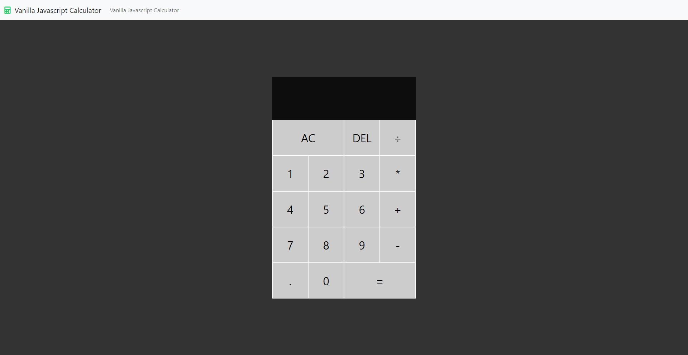

# Vanilla Javascript Calculator

Vanilla JavaScript Calculator Application Using Modern ES6 Syntax and Classes

<a href="https://mogrady-professional.github.io/VanillaJavascriptCalculator/"><a/>

<h1 align="center">

</h1>
